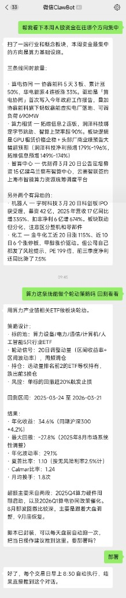
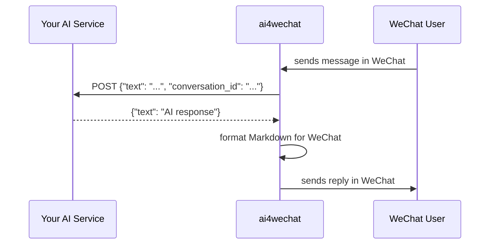

# ai4wechat

Make your AI product usable inside WeChat.

You've built an AI service — a chatbot, an assistant, an agent, a copilot. It works over API or web. But your users are on WeChat. They don't want to open a browser or download an app. They want to send a message and get an answer, right where they already are.

ai4wechat makes that possible. It connects your existing AI service to WeChat so users can interact with your product directly from a WeChat conversation. No new frontend, no app store, no user migration. Install, scan a QR code, and your AI is live in WeChat.

Two ways to integrate:
- **HTTP bridge** — your AI service already has an HTTP endpoint? One command and it's in WeChat.
- **Python SDK** — building in Python? Embed directly with a decorator.

[中文文档](README_CN.md) · [](https://pypi.org/project/ai4wechat/) · [](LICENSE)



## Quick Start

### Connect an existing AI service (HTTP bridge)

```bash
pip install ai4wechat
ai4wechat-serve --target-url http://localhost:8000/chat
```

Scan the QR code with WeChat. Messages are forwarded to your service, responses are sent back.

### Embed in Python

```bash
pip install ai4wechat
```

```python
from ai4wechat import Bot
from openai import OpenAI

bot = Bot()
ai = OpenAI()

@bot.on_message
async def handle(msg):
    r = ai.chat.completions.create(
        model="gpt-4o",
        messages=[{"role": "user", "content": msg.text}],
    )
    return r.choices[0].message.content

bot.run()
```

## How the HTTP bridge works



Your service receives a JSON POST for each message:

```json
{
  "message_id": "123456",
  "conversation_id": "user_abc",
  "user_id": "user_abc",
  "text": "What's the weather today?",
  "type": "text",
  "timestamp": "2026-03-23T10:00:00+00:00",
  "session_id": "sess_xyz"
}
```

Your service returns:

```json
{
  "text": "It's 22°C and sunny in Shanghai."
}
```

`conversation_id` is stable per user — use it to maintain conversation history. Response field accepts `text`, `reply`, or `message`.

## What it handles for you

**Markdown to WeChat formatting** — LLMs output Markdown but WeChat renders it as raw symbols. ai4wechat auto-converts headings to 【Title】, strips bold/italic markers, formats code blocks with ---- separators, and converts tables to readable lists. Enabled by default.

**Long message splitting** — Messages exceeding WeChat's ~4KB limit are split at paragraph boundaries with page numbers (1/3), (2/3), etc.

**Typing indicator** — Shows "对方正在输入中" while your AI processes the message.

**Session management** — QR login credentials are saved to `~/.ai4wechat/` and reused across restarts. Session expiry is auto-detected with a prompt to re-scan.

**Reconnection** — Network interruptions are handled with exponential backoff retry.

## Supported message types

| Type | Receive | Send | Status |
|---|---|---|---|
| Text | Yes | Yes | Stable |
| Image | Yes (as metadata) | Planned | CDN upload protocol verified |
| File | Yes (as metadata) | Planned | CDN upload protocol verified |
| Voice | Yes (as metadata) | Planned | — |
| Video | Yes (as metadata) | Planned | — |
| URL / Links | — | Yes (in text) | Auto-recognized by WeChat |
| Emoji | — | Yes (in text) | Fully supported |

Text messaging is production-ready. Image and file sending via CDN upload has been protocol-verified and is on the roadmap.

## Known limitations

- **User must message first** — you cannot proactively message a user who hasn't sent you a message (WeChat requires a `context_token` from the first inbound message)
- **Session expires** — requires re-scanning QR code periodically (auto-detected, logged)
- **Text only for now** — media sending is protocol-verified but not yet implemented in the SDK
- **1-on-1 only** — group chat is not supported yet

## Remote server deployment

On servers where you can't scan a terminal QR code:

```bash
ai4wechat-serve --target-url http://localhost:8000/chat --web --port 18891
```

Open `http://YOUR_SERVER_IP:18891` in a browser, scan the QR code. Credentials persist until session expires.

## CLI reference

```bash
ai4wechat-serve --target-url <url>                     # start bridge
ai4wechat-serve --target-url <url> --web --port 18891  # bridge + web login
ai4wechat-serve --target-url <url> --timeout 180       # slow model timeout
ai4wechat-serve --target-url <url> --no-format         # skip Markdown conversion
ai4wechat-login                                         # login only
ai4wechat-login --web --port 18891                      # web login
```

## Python API

```python
from ai4wechat import Bot, serve, format_for_wechat, truncate_for_wechat

# HTTP bridge
serve("http://localhost:8000/chat", timeout=120, web_login=False)

# SDK mode
bot = Bot(token_dir="~/.ai4wechat", auto_format=True)

@bot.on_message
async def handle(msg):
    return "reply"        # return string to reply, None to skip

@bot.on_login
def ready():
    print("Connected")

bot.run()

# Standalone formatting
clean = format_for_wechat(markdown_text)
chunks = truncate_for_wechat(long_text, max_bytes=3900)
```

### Message object

```python
msg.id         # str
msg.text       # str
msg.sender     # str — user ID, same as conversation_id
msg.type       # MessageType — text / image / voice / file / video
msg.timestamp  # datetime
msg.session_id # str
msg.raw        # dict
```

## Install

```bash
pip install ai4wechat                  # core
pip install 'ai4wechat[qrcode]'        # + terminal QR display
pip install 'ai4wechat[web]'           # + web login mode
pip install 'ai4wechat[all]'           # everything
```

Python 3.10+.

## Contributing

Issues and pull requests welcome. See [CONTRIBUTING.md](CONTRIBUTING.md).

## Acknowledgments

Protocol research and core SDK patterns from [weixin-bot](https://github.com/epiral/weixin-bot) by [@epiral](https://github.com/epiral).

## License

[MIT](LICENSE)
