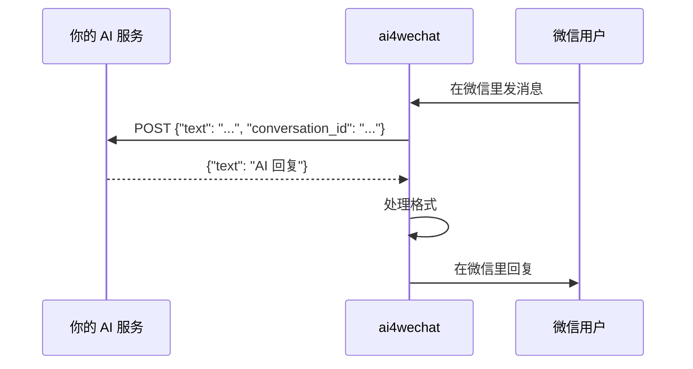

# ai4wechat

让你的 AI 产品在微信里直接用。

你花了很长时间做了一个 AI 产品。可能是个聊天助手，可能是个客服系统，可能是个帮人写方案的 Agent。产品本身没问题，API 也跑通了。

但用户一句话让你头疼：**"能不能在微信里用？"**

他们不想开网页，不想下 App，就想在微信里问一句就拿到答案。

ai4wechat 干的就是这件事。你的 AI 服务不用改，装一个包、扫个码，用户就能在微信里用你的产品了。

两种接入方式：
- **HTTP 桥接** — 服务有 HTTP 接口？一条命令就能接微信
- **Python SDK** — Python 项目？加个装饰器就行

[English](README.md) · [](https://pypi.org/project/ai4wechat/) · [](LICENSE)


## 为什么是 ai4wechat

ai4wechat 的优势不是抽象的“能接微信”，而是它已经把真正麻烦的部分处理掉了：

- **现有服务不用改**：你的 AI 如果已经有 HTTP 接口，直接桥接进去就行
- **不只是文本**：微信里发来的文本、图片、语音、文件、视频都会被识别
- **媒体会结构化透传**：服务端拿到的不只是 `[图片]`、`[语音]` 这种占位文本，还能拿到结构化媒体信息
- **微信格式问题已经处理**：Markdown、代码块、表格会自动转成微信可读的样子
- **长消息不会炸**：超长内容自动分段带页码
- **部署和登录都顺手**：扫码登录、远程 Web 登录、会话管理、断线重连都已经处理好

## 快速开始

### 接入现有服务（HTTP 桥接）

```bash
pip install ai4wechat
ai4wechat-serve --target-url http://localhost:8000/chat
```

扫码就完事了。用户在微信里发消息，你的 AI 回复。

### 直接嵌入 Python 项目

```bash
pip install ai4wechat
```

```python
from ai4wechat import Bot
from openai import OpenAI

bot = Bot()
ai = OpenAI()

@bot.on_message
async def handle(msg):
    r = ai.chat.completions.create(
        model="gpt-4o",
        messages=[{"role": "user", "content": msg.text}],
    )
    return r.choices[0].message.content

bot.run()
```

## HTTP 桥接是怎么跑的



你的服务收到这样的 JSON：

```json
{
  "message_id": "123456",
  "conversation_id": "user_abc",
  "user_id": "user_abc",
  "text": "今天天气怎么样？",
  "type": "text",
  "timestamp": "2026-03-23T10:00:00+00:00",
  "session_id": "sess_xyz"
}
```

返回这样就行：

```json
{
  "text": "上海今天 22°C，晴天。"
}
```

`conversation_id` 同一个用户不会变，拿来做多轮对话上下文就行。返回字段支持 `text`、`reply` 或 `message`。

## 多消息类型输入

ai4wechat 不只是把“文字聊天”接进微信。

用户在微信里发来的：
- 文本
- 图片
- 语音
- 文件
- 视频

现在都已经能被识别，并以结构化数据转发给你的服务。

这点很重要，因为很多 AI 服务真正需要知道的不是“用户发没发消息”，而是：
- 用户发的是不是一张图
- 用户发的是不是一段语音
- 用户发的是不是一个文件

ai4wechat 已经把这些信息整理成 `media` 数组，不需要你自己从原始字段里再猜。

### 文本消息 payload 示例

```json
{
  "message_id": "msg_text_001",
  "conversation_id": "user_abc",
  "user_id": "user_abc",
  "text": "今天天气怎么样？",
  "type": "text",
  "has_media": false,
  "media": [],
  "timestamp": "2026-03-23T10:00:00+00:00",
  "session_id": "sess_xyz",
  "raw": {}
}
```

### 语音消息 payload 示例

```json
{
  "message_id": "msg_voice_001",
  "conversation_id": "user_abc",
  "user_id": "user_abc",
  "text": "[Voice] hello",
  "type": "voice",
  "has_media": true,
  "media": [
    {
      "type": "voice",
      "text": "hello",
      "raw": {
        "text": "hello"
      }
    }
  ],
  "timestamp": "2026-03-23T10:00:00+00:00",
  "session_id": "sess_xyz",
  "raw": {
    "items": [
      {
        "type": 3
      }
    ]
  }
}
```

### 文件消息 payload 示例

```json
{
  "message_id": "msg_file_001",
  "conversation_id": "user_abc",
  "user_id": "user_abc",
  "text": "[File: report.pdf]",
  "type": "file",
  "has_media": true,
  "media": [
    {
      "type": "file",
      "file_name": "report.pdf",
      "raw": {
        "file_name": "report.pdf"
      }
    }
  ],
  "timestamp": "2026-03-23T10:00:00+00:00",
  "session_id": "sess_xyz",
  "raw": {
    "items": [
      {
        "type": 4
      }
    ]
  }
}
```

## 它帮你搞定的事

**Markdown 格式问题** — 大模型喜欢输出 Markdown，但微信不认。标题、加粗、代码块、表格全显示成原始符号。ai4wechat 发送前自动帮你转成微信能正常读的纯文本。

**消息太长** — 微信单条上限大概 4KB。超了的话 ai4wechat 会在段落边界自动切开，加上 (1/3)、(2/3) 这样的页码。

**输入状态** — AI 处理的时候自动给用户显示"对方正在输入中"，不会让人觉得没反应。

**登录凭证** — 扫一次码，凭证存在 `~/.ai4wechat/` 下面，下次启动直接用，不用重复扫。过期了自动提醒。

**断线重连** — 网络抖动自动重试。

## 消息类型支持

| 类型 | 输入侧（微信 → 你的服务） | 输出侧（你的服务 → 微信） | 状态 |
|---|---|---|---|
| 文本 | 结构化转发 | 稳定可用 | 已可生产使用 |
| 图片 | 结构化媒体元信息 | 规划中 | 输入已支持，输出协议已验证 |
| 语音 | 结构化媒体元信息 + 转写文本（若存在） | 规划中 | 输入已支持 |
| 文件 | 结构化媒体元信息 + 文件名 | 规划中 | 输入已支持，输出协议已验证 |
| 视频 | 结构化媒体元信息 | 规划中 | 输入已支持 |
| 链接 / Emoji | 在文本里一起转发 | 稳定可用 | 微信自动识别 |

这里最重要的区分是：
- **输入侧**：文本、图片、语音、文件、视频都已经能识别并结构化透传
- **输出侧**：文本稳定；媒体发送的协议已经验证过，SDK 还在补完

## 目前的限制

- 用户必须先给你发一条消息，你才能回复（微信的 `context_token` 机制）
- 登录会话会过期，过期后需要重新扫码（自动检测）
- 媒体发送还没做完（协议跑通了，SDK 在路线图里）
- 暂时只支持一对一，群聊还没做

## 部署到服务器

在没法扫终端二维码的服务器上：

```bash
ai4wechat-serve --target-url http://localhost:8000/chat --web --port 18891
```

浏览器开 `http://服务器IP:18891` 扫码就行。凭证会存下来，重启不用再扫。

## 命令行

```bash
ai4wechat-serve --target-url <url>                     # 启动桥接
ai4wechat-serve --target-url <url> --web --port 18891  # 带 Web 登录
ai4wechat-serve --target-url <url> --timeout 180       # 模型推理慢就调大超时
ai4wechat-serve --target-url <url> --no-format         # 不做 Markdown 转换
ai4wechat-login                                         # 只登录不桥接
ai4wechat-login --web --port 18891                      # Web 登录
```

## Python API

```python
from ai4wechat import Bot, serve, format_for_wechat, truncate_for_wechat

# 桥接模式
serve("http://localhost:8000/chat", timeout=120, web_login=False)

# SDK 模式
bot = Bot(token_dir="~/.ai4wechat", auto_format=True)

@bot.on_message
async def handle(msg):
    return "reply"        # 返回字符串就回复，返回 None 就不回

@bot.on_login
def ready():
    print("连上了")

bot.run()

# 格式化工具单独用
clean = format_for_wechat(markdown_text)
chunks = truncate_for_wechat(long_text, max_bytes=3900)
```

### 示例：如何处理图片 / 语音 / 文件

看 [`examples/http_media_echo.py`](examples/http_media_echo.py)。

这个例子会展示：
- 收到文本就回文本
- 收到语音就优先读取 `media[0].text`
- 收到图片就回“我收到一张图片”
- 收到文件就回文件名

目标很简单：让你第一次看就知道，**这不只是文本聊天，微信里的媒体输入你也能拿到。**

### Message

```python
msg.id         # str
msg.text       # str
msg.sender     # str — 用户 ID，就是 conversation_id
msg.type       # MessageType — text / image / voice / file / video
msg.media      # list[dict] — 结构化媒体元信息
msg.timestamp  # datetime
msg.session_id # str
msg.raw        # dict
```

## 安装

```bash
pip install ai4wechat                  # 核心
pip install 'ai4wechat[qrcode]'        # 终端显示二维码
pip install 'ai4wechat[web]'           # Web 登录
pip install 'ai4wechat[all]'           # 全装
```

Python 3.10+。

## 贡献

欢迎 Issue 和 PR。详见 [CONTRIBUTING.md](CONTRIBUTING.md)。

## 致谢

协议研究和核心 SDK 模式来自 [@epiral](https://github.com/epiral) 的 [weixin-bot](https://github.com/epiral/weixin-bot)。

## License

[MIT](LICENSE)
